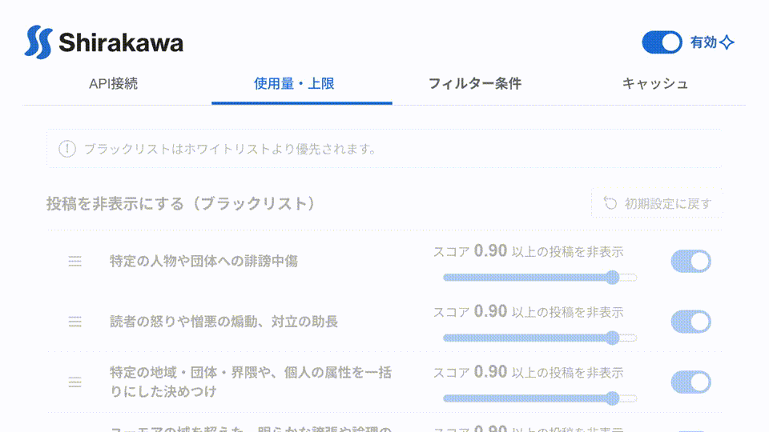

<h1 align="center">
  
</h1>

<p align="center">
  Xのタイムラインを、読みたい内容だけに。
</p>

<p align="center">
  <a href="https://chromewebstore.google.com/detail/shirakawa/gnlkgpphbjmbfpgbicaebhlmacnnhmmf"></a>
</p>

<p align="center">
  <a href="https://github.com/midorisawa/Shirakawa/releases"></a>
  <a href="https://github.com/midorisawa/Shirakawa/actions/workflows/release.yml"></a>
  <a href="LICENSE"></a>
  <a href="https://typesafe.ai"></a>
</p>

Shirakawaは、AIモデル「Jev」を活用し、設定した条件に合うXの投稿を自動で非表示にするブラウザー拡張機能です。キーワードの一致だけではフィルタリングが難しい内容も、投稿本文の文脈や意味に基づいて柔軟に判定します。  

「怒りや憎悪の煽動」、「属性を一括りにした決めつけ」など、見たくない投稿の特徴を自然言語で設定できます。

<br>

<p align="center">
  
</p>

<br>

## できること
- **自然な言葉で判定条件を指定**：非表示にしたい投稿の特徴を、文章でそのまま直感的に指定できます。

- **判定基準のきめ細かな調整**：ルールごとの有効・無効や判定しきい値を個別に調整できるほか、非表示になった投稿がどのルールに該当したのか、判定スコアとともに確認できます。

- **API利用量の管理と上限設定**：APIの使用量や概算費用をひと目で確認でき、期間ごとの利用上限を設定して使いすぎを防げます。

- **キャッシュによる重複判定の削減**：判定結果をブラウザー内にキャッシュすることで、同じ投稿に対する無駄な再判定やAPIの消費を抑えます。

- **設定のエクスポートとインポート**：作成したルールをJSON形式で書き出し、別の環境へスムーズに引き継げます。

<br>

## 注意点

- ご利用には、TypeSafe AIまたはOpenRouterのAPIキーが必要です。APIの利用料金は各サービスの規定に従います。

- 判定対象は投稿本文のみです。画像・動画やリンク先の内容は判定しません。

- AIによる判定は常に完全とは限らず、誤判定が生じる場合があります。

<br>

## データの取り扱い

- 判定の際、投稿本文、設定した判定条件、APIキー、選択したモデル情報は、選択したAPIサービスへブラウザーから直接送信されます。Shirakawaの開発者サーバーを経由することはありません。

- APIキーや設定内容、判定済み投稿のID、判定結果、利用量データはすべてブラウザー内に保存されます。詳しくは[プライバシーポリシー](docs/PRIVACY.md)をご確認ください。

<br>

## はじめかた

### 1. APIキーを用意する

投稿の判定にはJevを使用します。接続先として[TypeSafe AI](https://typesafe.ai)または[OpenRouter](https://openrouter.ai/)を選択し、各サービスでAPIキーを取得してください。利用料金は各サービスの規定に従います。

### 2. Shirakawaをインストールする

- Chromeをご利用の場合は、[Chrome Web Storeからインストール](https://chromewebstore.google.com/detail/shirakawa/gnlkgpphbjmbfpgbicaebhlmacnnhmmf)できます。<br><br><a href="https://chromewebstore.google.com/detail/shirakawa/gnlkgpphbjmbfpgbicaebhlmacnnhmmf"></a>

- [GitHub Releases](https://github.com/midorisawa/Shirakawa/releases)からZIPファイルをダウンロードしてインストールすることもできます。ChromeまたはEdgeの拡張機能管理画面で開発者モードを有効にし、「パッケージ化されていない拡張機能を読み込む」から、展開したZIPフォルダー内の`manifest.json`が含まれるフォルダーを選択してください。

### 3. APIキーとルールを設定する

拡張機能の設定画面を開き、APIの接続先とキーを登録した上で、表示・非表示にしたい投稿の条件を追加します。設定を保存すると、Xのタイムライン上で自動判定が始まります。

<br>

## 開発者向け

Node.jsとpnpmを用意して、以下を実行します。

```sh
git clone https://github.com/midorisawa/Shirakawa.git
cd Shirakawa
pnpm install
pnpm test
pnpm build
```

ビルド後は、拡張機能管理画面から`dist`フォルダーを読み込むことで利用できます。

<br>

## ライセンス

本体のコードは[MIT License](LICENSE)のもとで提供されます。サードパーティ製素材の権利表示およびライセンス条件は[THIRD_PARTY_NOTICES.txt](THIRD_PARTY_NOTICES.txt)をご確認ください。
