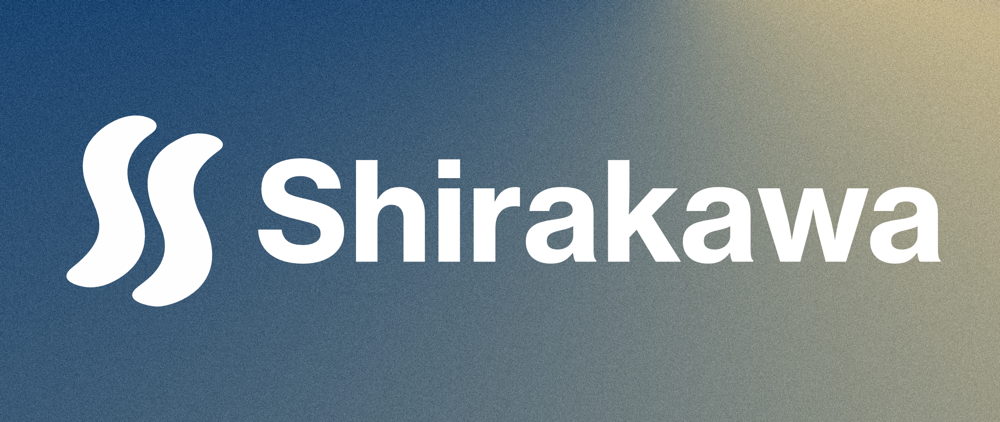
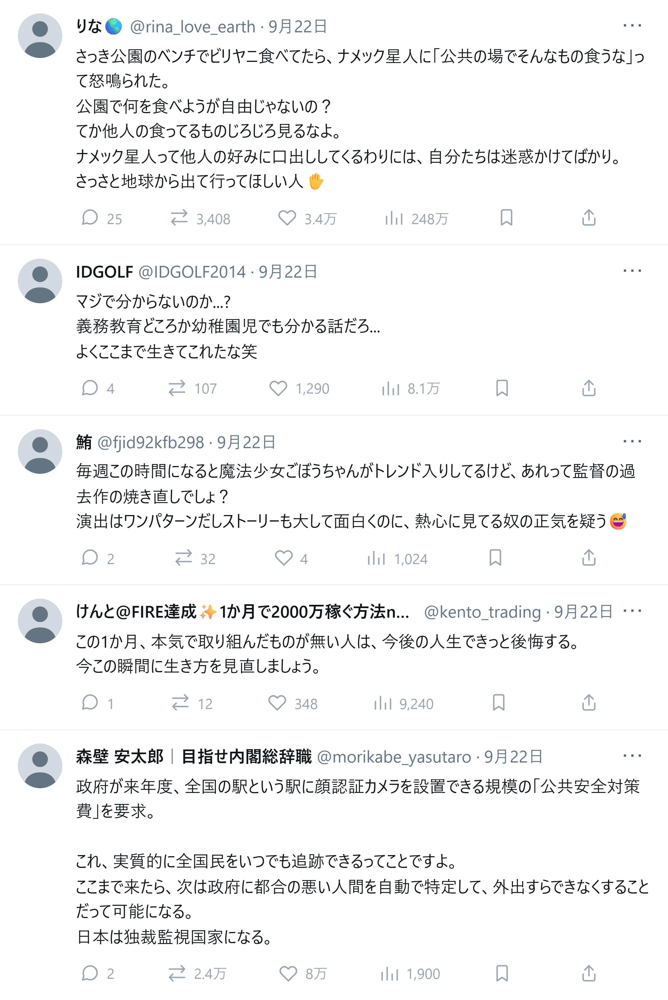
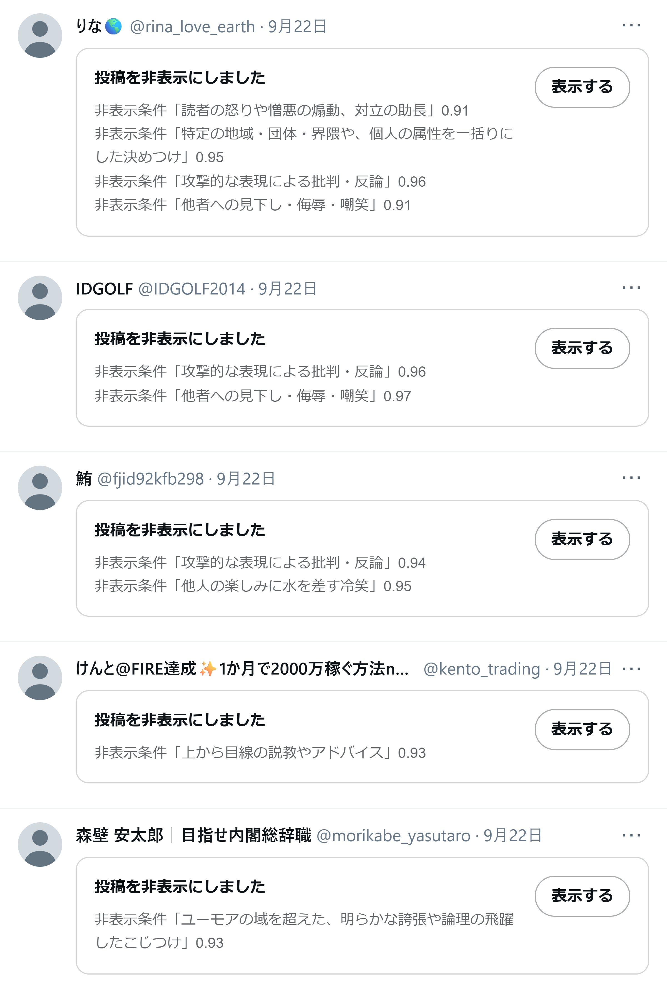
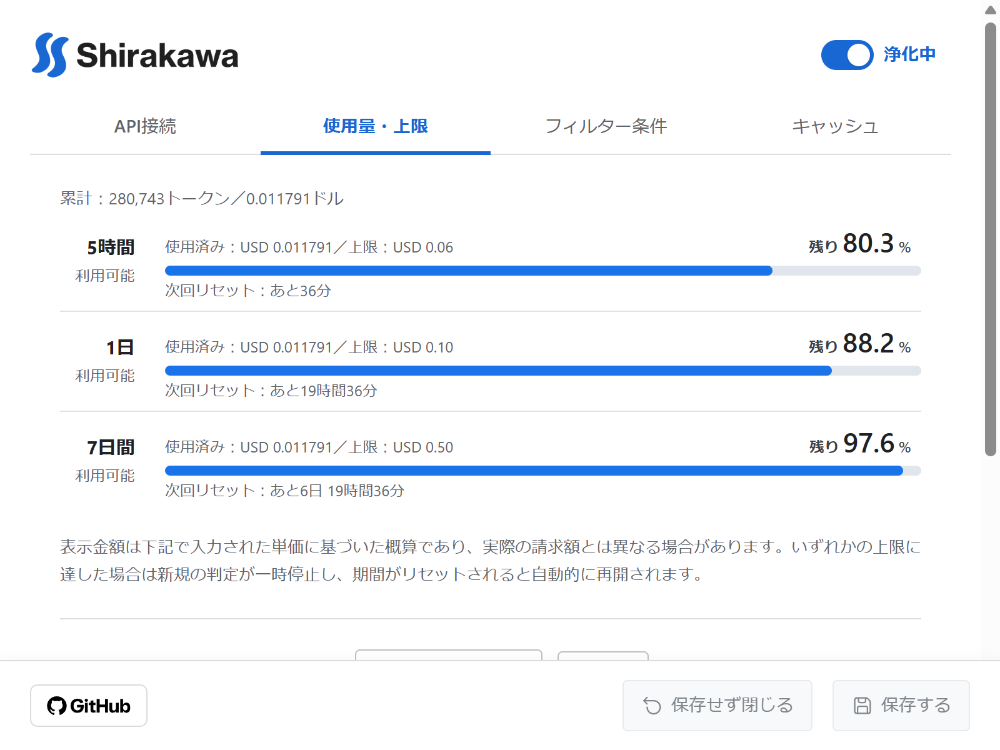
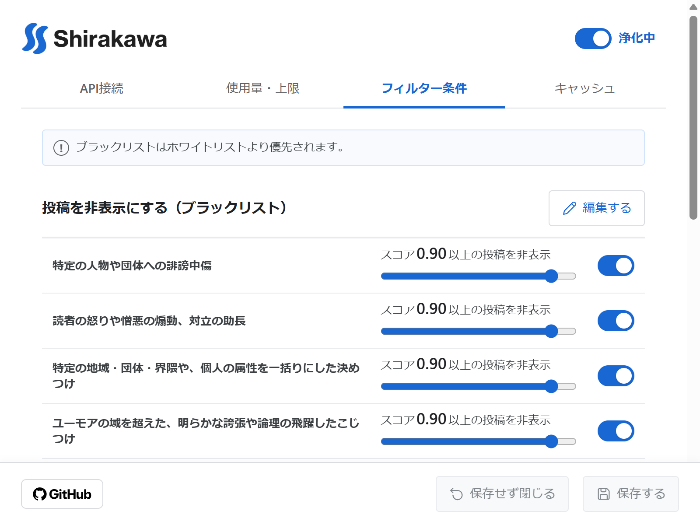

# Shirakawa（白河）

<p align="center">
    
</p>

X（旧Twitter）で、指定した条件に合う投稿を非表示にできるブラウザ拡張機能です。  
判断特化型AIであるJevを使用することで、表示/非表示の条件を自然言語で指定し、迅速に判定できることが特徴です。  

|フィルターOFF|フィルターON|
|---|---|
|||

## 主な機能
- ブラックリストの条件（例：特定の人物や団体への誹謗中傷）に該当する投稿を非表示にする  
- ホワイトリストの条件に該当する投稿（例：○○に関するネガティブでない投稿）のみを表示する  
- 条件ごとの閾値・有効状態・判定理由・スコアを管理できる  
- 条件をJSON形式でバックアップ・復元可能  
- 投稿IDごとの判定結果を最大30日間キャッシュ
- 同一投稿IDの本文が変化しても、キャッシュ有効期限内は既存の判定結果を使用
- 管理画面から、使用トークン数や概算使用額を確認できる  
- 期間ごと使用額の上限を設定でき、上限までの残り使用可能量も分かる  

※条件判定できるのは投稿本文のみです。添付された画像・動画・リンク先の内容は判定対象に含まれません。  

<p align="center">
      
</p>

## APIキーの準備
表示/非表示判定には判断特化型AIであるJevを使用します。  
JevはAPIを通じて利用します。（APIの提供元はJevの開発元であるTypeSafe AIとAIルーティングサービスのOpenRouterから選択できます。）  
APIキーは各自で用意してください。
> [!NOTE]
> APIキーはブラウザ内にローカル保存され、選択したAPI以外には送信されません。

### TypeSafe AI
[TypeSafe](https://typesafe.ai)にサインインし、APIキーを取得する。  

### OpenRouter
[OpenRouter](https://openrouter.ai/)にサインインし、APIキーを取得する。  

## 導入手順
### 方法1：Chrome/Edgeのウェブストアからダウンロード
各ウェブストアで「Shirakawa」を検索し、拡張機能を追加してください。公開後はこの節に掲載するリンクからも追加できます。  

### 方法2：ReleasesからZIPファイルをダウンロードして読み込む
[Releases](https://github.com/midorisawa/Shirakawa/releases)から対象バージョンのZIPファイル（`shirakawa-<バージョン>.zip`）をダウンロードして展開します。ChromeまたはEdgeの拡張機能管理画面で「デベロッパー（開発者）モード」を有効にし、「パッケージ化されていない拡張機能を読み込む」を選択して、`manifest.json`が入っているフォルダーを指定してください。  

### 方法3：ビルドして読み込む（開発者向け）

```sh
git clone https://github.com/midorisawa/Shirakawa.git
cd Shirakawa
pnpm install
pnpm build
```

ビルドが完了したら、ChromeまたはEdgeの拡張機能管理画面で「デベロッパー（開発者）モード」を有効にし、「パッケージ化されていない拡張機能を読み込む」を選択して、生成された`dist`フォルダーを指定してください。  

## ドキュメント
- [プライバシーポリシー](docs/PRIVACY.md)
- [公開物検証手順](docs/VERIFICATION.md)  

## ライセンス
コードは[MIT License](LICENSE)のもとで提供します。  
サードパーティ製素材の著作権表示やライセンス条件は[THIRD_PARTY_NOTICES.txt](THIRD_PARTY_NOTICES.txt)を確認してください。  
